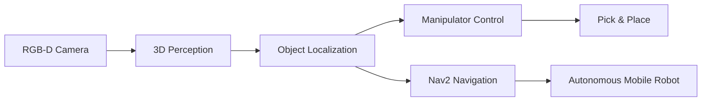

<div align="center">


[](https://git.io/typing-svg)

<br />

<a href="https://github.com/KweonTJ?tab=followers"></a>


</div>

---

## 🤖 Robotics Developer Mode

```yaml
name: Kwon Taek Ju
role: Robotics Engineer
mission: Turn perception data into reliable robot behavior
stack:
  middleware: ROS 2 Humble
  languages: [C++, Python]
  platforms: [Ubuntu 22.04, Mobile Manipulator, RGB-D Camera]
  domains: [3D Perception, Manipulation, Navigation, Multi-Robot Systems]
currently_building: 3D perception based mobile manipulator + autonomous navigation system
```

I develop robot systems that connect **3D perception**, **motion planning**, **manipulator control**, and **Nav2-based autonomous navigation** into practical robotic workflows.

---

## 🧠 Core Signals

<table>
<tr>
<td width="50%" valign="top">

### Perception
- RGB-D camera pipelines
- 3D object localization
- OpenCV-based preprocessing
- RViz visualization for debugging

</td>
<td width="50%" valign="top">

### Robot Intelligence
- ROS 2 node architecture
- Mobile manipulator integration
- Pick & Place workflows
- Nav2 autonomous navigation

</td>
</tr>
</table>

---

## 🚀 Featured Project

<div align="center">

<a href="https://github.com/KweonTJ/3D_pereception_Based_Mobile_Manipulator-Autonomous_Navigation_System">
  
</a>

</div>

### 3D Perception Based Mobile Manipulator & Autonomous Navigation System

ROS 2 기반 모바일 매니퓰레이터 시스템입니다. 3D 카메라로 객체 위치를 추정하고, 매니퓰레이터 제어와 자율주행을 하나의 로봇 시스템으로 통합하는 프로젝트입니다.



**Highlights**
- 3D camera based object localization
- Mobile manipulator control
- Pick & Place task flow
- Nav2 based autonomous navigation
- RViz visualization and system debugging

---

## 🛠️ Tech Arsenal

<div align="center">


<br /><br />


</div>

---

## 📡 GitHub Telemetry

<div align="center">


<br /><br />


</div>

---

## 🧭 Engineering Philosophy

> Build robot software like real robots depend on it: modular, observable, testable, and ready for the messy physical world.

<div align="center">


</div>
